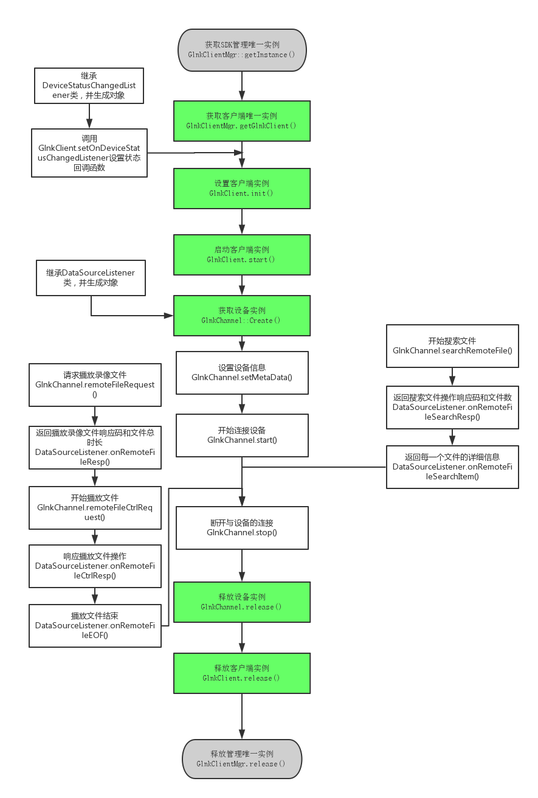

录像查找&&录像回放
===

---
流程图如下



---

Code
---

```C
#include <string.h>
#include "GlnkClientMgr.h"
#include "glnk_client.h"
#include "DataSourceListener2.h"
#include "DeviceStatusChangedListener.h"
#include "glnk_client_GlnkChannel.h"
#include "glnk_client_LanSearchIndep.h"
#include "glnk_utils.h"
#include "OnLanSearchListener.h"
#include "glnk_errno.h"

#ifdef WIN32
#pragma comment(lib, "glnkclient.lib")
#pragma comment(lib, "libglnkcclient.a")
#endif

class DeviceStatus :public DeviceStatusChangedListener
{
	virtual void onChanged(const char* gid, int status)
	{
		printf("[测试代码]%s 状态码为：%d\n", gid, status);
	}
};

static char g_filename[512] = { 0 };
static GlnkChannel* g_channel = NULL;

class DataSource : public DataSourceListener
{
	virtual void onConnecting(){
		printf("[测试代码]开始连接设备\n");
	}


	virtual void onConnected(int mode, const char* ip, unsigned short port){
		printf("[测试代码]连接完成，连接模式为：%d , 设备ip：%s, 设备端口： %d \n", mode, ip, port);
	}

	virtual void onModeChanged(int mode, const char* ip, unsigned short port){
		printf("[测试代码]连接模式更改，连接模式为：%d , 设备ip：%s, 设备端口： %d \n", mode, ip, port);
	}

	virtual void onDisconnected(int errcode) {
		printf("[测试代码]连接被非主动断开，断开码:%d\n", errcode);
	}


	virtual void onReConnecting() {
		printf("[测试代码]正在重新连接\n");
	}

	virtual void onAuthorized(int result){
		printf("[测试代码]登录设备反馈码：%d\n", result);
	}

	virtual void onDataRate(unsigned int bytesPersecond) {
		printf("[测试代码]每秒流量为:%d\n", bytesPersecond);
	}

	virtual void onAVStreamFormat(void *data, unsigned int length) {

		GlnkStreamFormat format = { 0 };

		int result = getGlnkStreamFormat(&format, data, length);
		printf("[测试代码]此处获取音视频信息\n");
	}

	virtual void onVideoData(const void *data, unsigned int length, unsigned int frameIndex, unsigned int timestamp, int isIFrame) {
		//printf("视频数据\n");
	}

	virtual void onAudioData(const void *data, unsigned int length, unsigned int timestamp) {
		//printf("音频数据\n");
	}

	virtual void onRemoteFileSearchResp(int result, int count){
		printf("[测试代码]查找文件响应码：%d， 文件个数：%d\n", result, count);
	}
	virtual void onRemoteFileSearchItem(const char *framename, int recordType,
		int startYear, int startMonth, int startDay, int startHour, int startMinute, int startSecond, int startMs,
		int endYear, int endMonth, int endDay, int endHour, int endMinute, int endSecond, int endMs) {
		printf("[测试代码]搜索到一个文件，文件名为：%s\n", framename);
		memcpy(g_filename, framename, strlen(framename));
	}


	virtual void onRemoteFileResp(int version, int result, int fileDuration) {
		printf("[测试代码]请求远程播放响应码为：%d，文件总长为：%d\n", result, fileDuration);
		if (2 == version && g_channel)
		{
			g_channel->remoteFileCtrlRequest(Play_Ctrl_Start, 0, 0, fileDuration);
		}
	}

	virtual void onRemoteFileEOF(){
		printf("[测试代码]录像文件播放完毕\n");	
	}
	virtual void onRemoteFileCtrlResp(int result, int ctrlCmd) {
		printf("[测试代码]响应文件操作%d，反馈码：%d\n", ctrlCmd, result);
	}


	virtual void onIOCtrl(unsigned short type, const void *data, unsigned short length) {}
	virtual void onTalkingResp(int result, int audiofmt, int audioChannels, int audioSampleRate, int audioBitsPerSample){}
	virtual void onKeepliveResp(int result){}
	virtual void onVideoDataManu(const void *data, unsigned int length, const void *frameInfo, unsigned int infoLength) {}
	virtual void onAudioDataManu(const void *data, unsigned int length, const void *frameInfo, unsigned int infoLength) {}
	virtual void onIOCtrlByManu(const void *data, unsigned short length){}

};


int main()
{
	const char* gid[] = { "bl06fb5c4x", "tt0xx244f8" };
	GlnkClient* client = NULL;
	GlnkChannel* channel = NULL;
	
	DeviceStatus* l = new DeviceStatus;
	DataSource* ds = new DataSource;

	GlnkClientMgr* clientMgr = GlnkClientMgr::getInstance();
	if (clientMgr)
	{
		client = clientMgr->getGlnkClient();
		if (client)
		{
			if (-1 == client->init("Demo", "20150914", "1234567890", 1, 1))//设置环境
				goto err;

			if (-1 == client->setOnDeviceStatusChangedListener(l))
				goto err;

			if (-1 == client->setStatusAutoUpdate(1))
				goto err;

			if (-1 == client->start())
				goto err;

			int re = 0;
			for (int i = 0; i < 2; i++)
				re = client->addGID(gid[i]);


			channel = GlnkChannel::Create(client, ds);
			if (channel)
			{
				re = channel->setMetaData("bl06fb5c4x", "admin", "admin", 0, 2, 2);
				re = channel->start();

				getchar();

				re = channel->searchRemoteFile(0x01, 0xFF, 2015, 12, 21, 00, 2015, 12, 21, 23);

				getchar();

				re = channel->remoteFileRequest(g_filename);
				g_channel = channel;
				getchar();
			}
		}
	}

err:
	if (channel)
	{
		channel->stop();
		channel->release();
	}

	if (client)
		client->release();
	if (clientMgr)
		clientMgr->release();

	delete l;
	delete ds;

	return 0;
}
```