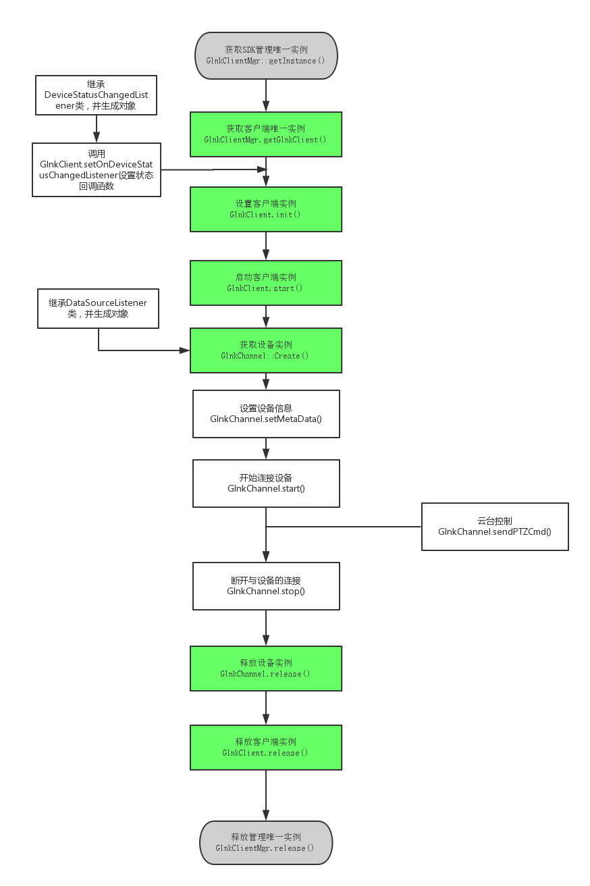

实时预览&&云台操作
===

---
流程图如下



---

Code
---

```C
#include "GlnkClientMgr.h"
#include "glnk_client.h"
#include "DataSourceListener2.h"
#include "DeviceStatusChangedListener.h"
#include "glnk_client_GlnkChannel.h"
#include "glnk_client_LanSearchIndep.h"
#include "glnk_utils.h"
#include "OnLanSearchListener.h"

#ifdef WIN32
#pragma comment(lib, "glnkclient.lib")
#pragma comment(lib, "libglnkcclient.a")
#endif

class DeviceStatus :public DeviceStatusChangedListener
{
	virtual void onChanged(const char* gid, int status)
	{
		printf("[测试代码]%s 状态码为：%d\n", gid, status);
	}
};

class DataSource : public DataSourceListener
{
	virtual void onConnecting(){
		printf("[测试代码]开始连接设备\n");
	}


	virtual void onConnected(int mode, const char* ip, unsigned short port){
		printf("[测试代码]连接完成，连接模式为：%d , 设备ip：%s, 设备端口： %d \n", mode, ip, port);
	}

	virtual void onModeChanged(int mode, const char* ip, unsigned short port){
		printf("[测试代码]连接模式更改，连接模式为：%d , 设备ip：%s, 设备端口： %d \n", mode, ip, port);
	}

	virtual void onDisconnected(int errcode) {
		printf("[测试代码]连接被非主动断开，断开码:%d\n", errcode);
	}


	virtual void onReConnecting() {
		printf("[测试代码]正在重新连接\n");
	}

	virtual void onAuthorized(int result){
		printf("[测试代码]登录设备反馈码：%d\n", result);
	}

	virtual void onDataRate(unsigned int bytesPersecond) {
		printf("[测试代码]每秒流量为:%d\n", bytesPersecond);
	}

	virtual void onAVStreamFormat(void *data, unsigned int length) {

		GlnkStreamFormat format = { 0 };

		int result = getGlnkStreamFormat(&format, data, length);
		printf("[测试代码]此处获取音视频信息\n");
	}

	virtual void onVideoData(const void *data, unsigned int length, unsigned int frameIndex, unsigned int timestamp, int isIFrame) {
		//printf("视频数据\n");
	}

	virtual void onAudioData(const void *data, unsigned int length, unsigned int timestamp) {
		//printf("音频数据\n");
	}

	
	virtual void onIOCtrl(unsigned short type, const void *data, unsigned short length) {}
	virtual void onKeepliveResp(int result){}
	virtual void onTalkingResp(int result, int audiofmt, int audioChannels, int audioSampleRate, int audioBitsPerSample){}
	virtual void onVideoDataManu(const void *data, unsigned int length, const void *frameInfo, unsigned int infoLength) {}
	virtual void onAudioDataManu(const void *data, unsigned int length, const void *frameInfo, unsigned int infoLength) {}
	virtual void onIOCtrlByManu(const void *data, unsigned short length){}
	virtual void onRemoteFileSearchResp(int result, int count){}
	virtual void onRemoteFileSearchItem(const char *framename, int recordType,
		int startYear, int startMonth, int startDay, int startHour, int startMinute, int startSecond, int startMs,
		int endYear, int endMonth, int endDay, int endHour, int endMinute, int endSecond, int endMs) {}
	virtual void onRemoteFileResp(int version, int result, int fileDuration) {}
	virtual void onRemoteFileEOF(){}
	virtual void onRemoteFileCtrlResp(int result, int ctrlCmd) {}
};


int main()
{
	const char* gid[] = { "bl0xxxa1ea", "tt0xx244f8" };
	GlnkClient* client = NULL;
	GlnkChannel* channel = NULL;
	
	DeviceStatus* l = new DeviceStatus;
	DataSource* ds = new DataSource;

	GlnkClientMgr* clientMgr = GlnkClientMgr::getInstance();
	if (clientMgr)
	{
		client = clientMgr->getGlnkClient();
		if (client)
		{
			if (-1 == client->init("Demo", "20150914", "1234567890", 1, 1))//设置环境
				goto err;

			if (-1 == client->setOnDeviceStatusChangedListener(l))
				goto err;

			if (-1 == client->setStatusAutoUpdate(1))
				goto err;

			if (-1 == client->start())
				goto err;

			int re = 0;
			for (int i = 0; i < 2; i++)
				re = client->addGID(gid[i]);


			channel = GlnkChannel::Create(client, ds);
			if (channel)
			{
				re = channel->setMetaData("bl0xxxa1ea", "admin", "admin", 0, 0, 2);
				re = channel->start();

				getchar();

				channel->sendPTZCmd(PTZCMD::PTZ_MV_UP);
				sleep(1000);//向上移动一秒
				channel->sendPTZCmd(PTZCMD::PTZ_MV_STOP);


				getchar();
			}
		}
	}

err:
	if (channel)
	{
		channel->stop();
		channel->release();
	}

	if (client)
		client->release();
	if (clientMgr)
		clientMgr->release();

	delete l;
	delete ds;

	return 0;
}

```