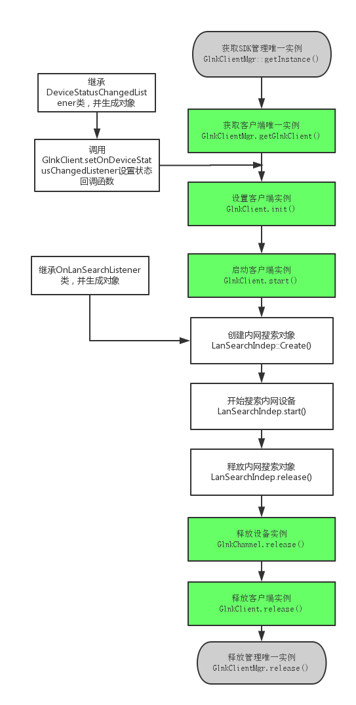

内网搜索
===

---
流程图如下



---

Code
---

```C
#include "GlnkClientMgr.h"
#include "glnk_client.h"
#include "DataSourceListener2.h"
#include "DeviceStatusChangedListener.h"
#include "glnk_client_GlnkChannel.h"
#include "glnk_client_LanSearchIndep.h"
#include "glnk_utils.h"
#include "OnLanSearchListener.h"
#include "glnk_errno.h"

#ifdef WIN32
#pragma comment(lib, "glnkclient.lib")
#pragma comment(lib, "libglnkcclient.a")
#endif

class SearchListener : public OnLanSearchListener
{
	virtual void onSearched(const char* gid, const char* ip) {
		printf("[测试代码]搜索到设备，GID：%s , IP: %s\n", gid, ip);
	}


	virtual void onSearchFinish(){
		printf("[测试代码]搜索完毕\n");
	}
};

int main()
{
	GlnkClient* client = NULL;
	LanSearchIndep* search = NULL;

	SearchListener* listener = new SearchListener;

	GlnkClientMgr* clientMgr = GlnkClientMgr::getInstance();
	if (clientMgr)
	{
		client = clientMgr->getGlnkClient();
		if (client)
		{
			if (-1 == client->init("Demo", "20150914", "1234567890", 1, 1))//设置环境
				goto err;

			if (-1 == client->setStatusAutoUpdate(1))
				goto err;

			if (-1 == client->start())
				goto err;

			search = LanSearchIndep::Create(listener);
			if (search)
			{
				search->start();

				getchar();
			}
		}
	}
err:
	if (search)
		search->release();
	if (client)
		client->release();
	if (clientMgr)
		clientMgr->release();

	return 0;
}
```